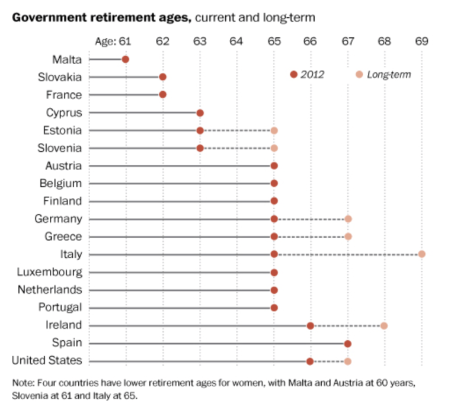
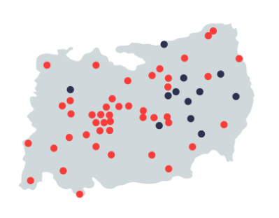
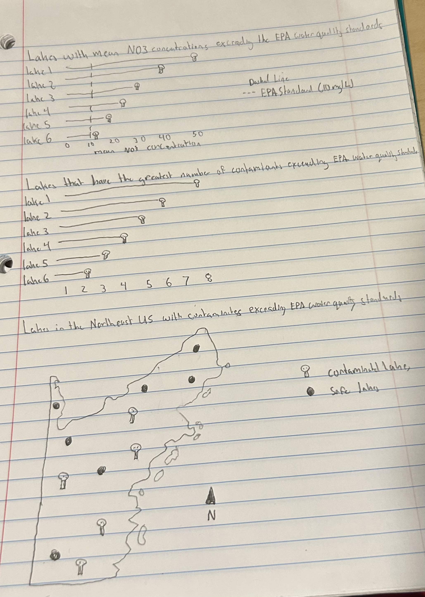

## III. Some pre-planning

### Before you start drafing your viz, answer the following questions:

1.  Restate the questions you hope to answer with your inforgraphic. This should include one overarching question (think of this as driving the overall theme of your infographic) and at least three subquestions (each of which will be addressed by your infographic’s component visualizations). Have these questions changed at all since FPM #1? If yes, how so?

-   Which lakes in the northeast United states have contaminant concentrations above the EPA Water Quality Standards?
    -   What lakes in the Northeast United States have a mean nitrate (NO3) concentration exceeding the EPA water quality standard of 10 mg/L?
    -   Which lakes have the greatest number of contaminants exceeding EPA Water Quality Standards?
    -   Where are the lakes that have contaminant concentrations above the EPA Water Quality Standards located? Are they close together and possibly being contaminated by the same source?
-   Yes, these questions have changed. I originally wanted to look at NH3, but my data set only has NH4, so I switched to NO3. Also, on my FPM #1 I only listed 2 subquestions, so I added : Where are the lakes that have contaminant concentrations above the EPA Water Quality Standards located? Are they close together and possibly being contaminated by the same source?

2.  Explain which variables from your data set(s) you will use to answer the above questions, and how.

-   sub question 1: `NO3` and `LAKENAME` will be used to answer this question. I will group by `LAKENAME` and calculate the mean `NO3` concentration for each lake.

-   sub question 2: `NH4, NO3, NTL, PTL, CHLA, CL, PHEQ, TURB` and `LAKENAME` will be used to answer this question. I will group by `LAKENAME` and calculate the mean `NH4, NO3, NTL, PTL, CHLA, CL, PHEQ, TURB` concentrations for each lake. I will then add columns that will have the EPA water quality standard for each contaminate. I will then use a for loop to see which contaminate surpasses the quality standard and will count the amount of contaminates suprass the quality standard.

-   sub question 3: `LAT_DD, LON_DD` and `LAKENAME` will be used to answer this question. I will plot all the lakes and color the lakes that have ontaminant concentrations above the EPA Water Quality Standards red and leave the safe lakes blue.

3. In FPM #2, you created some exploratory data viz to better understand your data. You may already have some ideas of how you plan to formally visualize your data, but it’s incredibly helpful to look at visualizations by other creators for inspiration. Find at least two data visualizations that you could (potentially) borrow / adapt pieces from. Download and embed them into your drafting-viz.qmd file, and explain which elements you might borrow (e.g. the graphic form, legend design, layout, etc.).

-   
```{r}
#| eval: true
#| echo: false
#| fig-align: "center"
#| out-width: "100%"
#| fig-alt: "This is an example lollipop graph that I would like to use in my inforgraphic"

```
the graphic form, legend design, layout, etc.

I will be using the lollipop graph for my first 2 sub-questions. It is a great and clean way to show multiple lakes contaminate concentrations. I will be changing the dots to make them another icon to make it more poweful of a message. I will not be using a legend in this plot.


```{r}
#| eval: true
#| echo: false
#| fig-align: "center"
#| out-width: "100%"
#| fig-alt: "This is a map that I would like to use in my inforgraphic"

```

I will be using a map like this for sub-question 3. I will implement a different type of basemap that has borders and shows state lines. I will definitely be using a basemap that has a plain layout. I will be keeping the coloring of sites also. I will be adding a legend that tells you which colors correspond to what.


## IV. Hand-draw your anticipated visualizations

### Before you begin coding, it’s a super useful practice to sketch out your anticipated visualizations by hand. This Medium article does a great job summarizing why this step matters.

1. Hand-draw your anticipated visualizations, then take a photo of your drawing(s) and embed it in your rendered drafting-viz.qmd file – note that these are not exploratory visualizations, but rather your plan for your final visualizations that you will eventually polish and include in your infographic.

```{r}
#| eval: true
#| echo: false
#| fig-align: "center"
#| out-width: "100%"
#| fig-alt: "Alt text here"

```

## V. Recreate your hand-drawn visualizations using code
### Mock up all of your hand drawn visualizations using code. We understand that you will continue to iterate on these into FPM #4 (particularly after receiving feedback), but by the end of FPM #3, you should:

have your data plotted (if you’re experimenting with a graphic form(s) that was not explicitly covered in class, we understand that this may take some more time to build; you should have as much put together as possible)
use appropriate strategies to highlight / focus attention on a clear message
include appropriate text such as titles, captions, axis labels (note: you may eventually convert some text, such as titles and captions, into annotations or text elements on your infographic; it’s still helpful to include titles, etc. on these stand-alone visualizations now, to provide your peer reviewers and instructional team with necessary context)
experiment with colors and typefaces / fonts
create a presentable / aesthetically-pleasing theme (e.g. (re)move gridlines / legends as appropriate, adjust font sizes, etc.)


```{r}
# Load in libraries
library(here)
library(tidyverse)
library(ggplot2)
library(ggimage)
library(sf)
library(tmap)
```

```{r}
# Read in Data
lake_data <- read_csv(here("data/EPA_EMAP_CHEM.csv"))
```

    -   What lakes in the Northeast United States have a mean nitrate (NO3) concentration exceeding the EPA water quality standard of 10 mg/L?

```{r fig.height = 7, fig.width=15}
#| fig-alt: "Lollipop plot of the lakes supassing the EPA Water Quality Standards in mean NO3 in the Northeast US, Waterloo Lakes has the highest"

# Find the mean NO3 value for each lake
grouped <- lake_data |>
  group_by(LAKENAME) |>
  summarize(mean_NO3 = mean(NO3))

# Convert units to mg/L
grouped$mean_NO3 <- grouped$mean_NO3 * 0.062

# Read in skull image
skull_url <- "https://th.bing.com/th/id/OIP.5nP8u8TbELdXKSszVmjoVQHaHa?w=183&h=183&c=7&r=0&o=7&dpr=2&pid=1.7&rm=3"

# Create figure
grouped |>
  arrange(desc(mean_NO3)) |>
  slice_head(n = 6) |>
  mutate(skull_img = skull_url) |>
  ggplot(aes(x = reorder(LAKENAME, mean_NO3),
             y = mean_NO3)) +
  geom_linerange(aes(ymin = 0, ymax = mean_NO3), color = "dodgerblue", size = 2) +
  geom_image(aes(image = skull_img), size = 0.09) +
  geom_text(aes(label = signif(mean_NO3, 3), hjust = -0.8)) + 
  geom_hline(aes(yintercept = 10, linetype = "EPA Standard (10 mg/L)"), color = "black", size = 1) +
  scale_linetype_manual(values = c("EPA Standard (10 mg/L)" = "dashed")) +
  labs(x = "Lakes",
       y = "Mean NO3 concentration",
       title = "Lakes with mean NO3 concentations exceeding the EPA Water Quality Standards (WQS)",
       linetype = "Dashed line",
       caption = "Data: USEPA EMAP Surface Waters Lake Database – Northeast Lake Water Chemistry (1991–1994)") +
  coord_flip() +
  theme_minimal() +
  theme(axis.title.y = element_blank()) +
  theme(
    text = element_text(size = 18),
    axis.text = element_text(size = 14),
    axis.title = element_text(size = 16),
    plot.title = element_text(size = 22, face = "bold"),
    legend.text = element_text(size = 14),
    legend.title = element_text(size = 16),
    plot.caption = element_text(size = 12)
)
```


-   Which lakes have the greatest number of contaminants exceeding EPA Water Quality Standards?


```{r fig.height = 7, fig.width=13}
#| fig-alt: "Lollipop plot of the total amount of EPA Water Quality Standards the top 50 lakes in the Northeast US surpass, Waterloo Lakes has the highest amount"


# Find the mean NH4, NO3, NTL, PTL, CHLA, CL, PHEQ, TURB value for each lake
grouped_2 <- lake_data |>
  group_by(LAKENAME) |>
  summarize(
    mean_NH4  = mean(NH4,  na.rm = TRUE),
    mean_NO3  = mean(NO3,  na.rm = TRUE),
    mean_NTL  = mean(NTL,  na.rm = TRUE),
    mean_PTL  = mean(PTL,  na.rm = TRUE),
    mean_CHLA = mean(CHLA, na.rm = TRUE),
    mean_CL   = mean(CL,   na.rm = TRUE),
    mean_PHEQ = mean(PHEQ, na.rm = TRUE),
    mean_TURB = mean(TURB, na.rm = TRUE),
    LAT_DD = mean(LAT_DD, na.rm = TRUE),
    LON_DD = mean(LON_DD, na.rm = TRUE)
  )

# Convert units to match EPA WQS

# NH4: microequivalentsPerLiter to mg/L
grouped_2$mean_NH4 <- grouped_2$mean_NH4 * 0.01804
# NO3: microequivalentsPerLiter to mg/L
grouped_2$mean_NO3 <- grouped_2$mean_NO3 * 0.062
# NTL: microgramsPerLiter to mg/L
grouped_2$mean_NTL <- grouped_2$mean_NTL / 1000
# PTL: microgramsPerLiter to mg/L
grouped_2$mean_PTL <- grouped_2$mean_PTL / 1000
# CL: microequivalentsPerLiter to mg/L
grouped_2$mean_CL <- grouped_2$mean_CL * 0.03545


# Add EPA WQS threshold columns
grouped_2$wqs_NH4   <- 0.1      # mg/L (lower protective limit)
grouped_2$wqs_NO3   <- 10       # mg/L
grouped_2$wqs_NTL   <- 1        # mg/L (natural level)
grouped_2$wqs_PTL   <- 0.10     # mg/L
grouped_2$wqs_CHLA  <- 5        # μg/L (good water quality threshold)
grouped_2$wqs_CL    <- 230      # mg/L
grouped_2$wqs_PHEQ  <- 7.0      # pH (neutral midpoint; range is 6.5-8.5)
grouped_2$wqs_TURB  <- 5        # NTU (aquatic standard)

# Count violations for each lake
grouped_2$violations <- 
  (grouped_2$mean_NH4 >= grouped_2$wqs_NH4) +
  (grouped_2$mean_NO3 >= grouped_2$wqs_NO3) +
  (grouped_2$mean_NTL >= grouped_2$wqs_NTL) +
  (grouped_2$mean_PTL >= grouped_2$wqs_PTL) +
  (grouped_2$mean_CHLA >= grouped_2$wqs_CHLA) +
  (grouped_2$mean_CL >= grouped_2$wqs_CL) +
  ((grouped_2$mean_PHEQ < 6.5) | (grouped_2$mean_PHEQ > 8.5)) +
  (grouped_2$mean_TURB >= grouped_2$wqs_TURB)


# Read in skull image
skull_url <- skull_url <- here::here("images/skull.png")

# Create figure
grouped_2 |>
  arrange(desc(violations)) |>
  slice_head(n = 8) |>
  mutate(skull_img = skull_url) |>
  ggplot(aes(x = reorder(LAKENAME, violations),
             y = violations)) +
  geom_linerange(aes(ymin = 0, ymax = violations), color = "blue", size = 2) +
  geom_image(aes(image = skull_img), size = 0.07) +
  geom_text(aes(label = violations, hjust = -2)) + 
  labs(x = "Lakes",
       y = "Number of EPA WQS Violations",
       title = "Lakes with Most EPA Water Quality Standards (WQS) Violations",
       caption = "Data: USEPA EMAP Surface Waters Lake Database – Northeast Lake Water Chemistry (1991–1994)",
       subtitle = "Contaminants examined: NH4, NO3, Cl, Total Nitrogen, Total Phosphorus, Chlorophyll A, pH, Turbidity") +
  coord_flip() +
  theme_minimal() +
  theme(axis.title.y = element_blank()) +
  theme(
    text = element_text(size = 18),
    axis.text = element_text(size = 14),
    axis.title = element_text(size = 16),
    plot.title = element_text(size = 22, face = "bold"),
    plot.subtitle = element_text(size = 13),
    legend.text = element_text(size = 14),
    legend.title = element_text(size = 16),
    plot.caption = element_text(size = 9),
    plot.background  = element_rect(fill = NA, color = NA),
    panel.background = element_rect(fill = NA, color = NA)
  )

ggsave("figure.png", bg = "transparent")
```


    -   Where are the lakes that have contaminant concentrations above the EPA Water Quality Standards located? Are they close together and possibly being contaminated by the same source?

```{r fig.height = 15, fig.width=15}
#| fig-alt: "Map of shwoing where lakes that have contaminant concentrations above the EPA Water Quality Standards are located in the Northeast U.S., where most are located in the south"

# Convert grouped_2 to spatial object
grouped_2_sf <- st_as_sf(grouped_2, 
                         coords = c("LON_DD", "LAT_DD"), 
                         crs = 4326)

# Rename violations column
grouped_2_sf <- grouped_2_sf %>%
  rename("Number of Violations" = "violations")

# Create tmap
tm_shape(grouped_2_sf) +
  tm_dots(col = "Number of Violations", 
          size = 0.8,
          palette = c("green", "yellowgreen", "gold", "orange", "red", "firebrick4", "black"),
          title = "Number of WQS Violations") +
  tm_basemap("CartoDB.Positron") +
  tm_layout(main.title = "Lakes with EPA Water Quality Standards Violations",
            main.title.size = 3,
            subtitle = "Contaminants examined: NH4, NO3, Cl, Total Nitrogen, Total Phosphorus, Chlorophyll A, pH, Turbidity",
            legend.title.size = 2,
            legend.text.size = 1.5,
            legend.outside = TRUE,
            legend.position = c("left", "bottom")) +
  tm_credits("Data: USEPA EMAP Surface Waters Lake Database – Northeast Lake Water Chemistry (1991–1994)",
             position = c("center", "bottom"),
             size = 0.9) +
  tm_compass(size = 5) +
  tm_scalebar(text.size = 1)
```

```{r}
library(tigris)
library(sf)

options(tigris_use_cache = TRUE)

states_ne <- c("ME","NH","VT","MA","RI","CT","NY","NJ","PA")

states_sf <- states(year = 2023) |>
  filter(STUSPS %in% states_ne) |>
  st_as_sf()
```

```{r fig.height = 30, fig.width= 30}
# Add manual offsets for each state abbreviation
states_sf <- states_sf %>%
  mutate(
    x_offset = case_when(
      STUSPS == "ME" ~ 0.9,
      STUSPS == "NH" ~ 0.5,
      STUSPS == "VT" ~ 0,
      STUSPS == "MA" ~ 0,
      STUSPS == "RI" ~ 0.55,
      STUSPS == "CT" ~ 0,
      STUSPS == "NY" ~ -0.5,
      STUSPS == "NJ" ~ 0.4,
      STUSPS == "PA" ~ 0,
      TRUE ~ 0
    ),
    y_offset = case_when(
      STUSPS == "ME" ~ 0.5,
      STUSPS == "NH" ~ 0.17,
      STUSPS == "VT" ~ 0.3,
      STUSPS == "MA" ~ 0.2,
      STUSPS == "RI" ~ -0.2,
      STUSPS == "CT" ~ -0.0,
      STUSPS == "NY" ~ 0,
      STUSPS == "NJ" ~ -0.3,
      STUSPS == "PA" ~ -0.2,
      TRUE ~ 0
    )
  )

tm_shape(states_sf) +
  tm_polygons(col = "#C7F5FC", border.col = "#41CBE2", lwd = 4) +  # translucent fill
  tm_text(
    "STUSPS", size = 3, col = "black", fontface = "bold",
    xmod = "x_offset", ymod = "y_offset"
  ) +
tm_shape(grouped_2_sf) +
  tm_dots(
    col = "Number of Violations", 
    size = 1.3,
    palette = c("green", "yellowgreen", "gold", "orange", "red", "firebrick4", "black")
  )+
tm_layout(
  frame = FALSE,  # removes the outer plot frame
  legend.show = TRUE  # ensures legends are displayed
) +
  tm_layout(main.title = "Lakes with EPA Water Quality Standards Violations",
            main.title.size = 3,
            subtitle = "Contaminants examined: NH4, NO3, Cl, Total Nitrogen, Total Phosphorus, Chlorophyll A, pH, Turbidity",
            legend.title.size = 2,
            legend.text.size = 1.5,
            legend.outside = TRUE,
            legend.position = c("left", "bottom"))

```
```{r fig.height = 30, fig.width= 30}
library(sf)

ne_outline <- states_sf |>
  st_union() |>
  st_as_sf()

NE_map <- 
  tm_shape(states_sf) +
  tm_polygons(col = "#C7F5FC", border.col = "#41CBE2", lwd = 4) +

  tm_shape(ne_outline) +
  tm_borders(col = "black", lwd = 10) +   # outer regional outline

  tm_shape(states_sf) +   # ensure labels use the correct data
  tm_text(
    "STUSPS",
    size = 3,
    col = "black",
    fontface = "bold",
    xmod = "x_offset",
    ymod = "y_offset"
  ) +

  tm_shape(grouped_2_sf) +
  tm_dots(
    col = "Number of Violations",
    size = 1.3,
    palette = c("green", "yellowgreen", "gold", "orange", "red", "firebrick4", "black")
  ) +

  tm_layout(
    frame = FALSE,
    legend.show = FALSE,
    bg.color = "transparent"
  ) +
  # Save the map exactly as it appears
tmap_save(
  tm = NE_map,
  filename = "NE_map.png",
  width = 30,   # matches your fig.width
  height = 30,  # matches your fig.height
  units = "in", # or "cm" if you prefer
  dpi = 300,     # high resolution for publication-quality image
  bg = "transparent"
)

NE_map
```


```{r fig.height = 35, fig.width=35}
#| fig-alt: "Map of shwoing where lakes that have contaminant concentrations above the EPA Water Quality Standards are located in the Northeast U.S., where most are located in the south"

# Convert grouped_2 to spatial object
grouped_2_sf <- st_as_sf(grouped_2, 
                         coords = c("LON_DD", "LAT_DD"), 
                         crs = 4326)

# Rename violations column and make it an integer
grouped_2_sf <- grouped_2_sf %>%
  rename(`Number of Violations` = violations) %>%
  mutate(`Number of Violations` = factor(`Number of Violations`))
```


```{r fig.height = 35, fig.width=35}
# Create tmap
tm_shape(grouped_2_sf) +
  tm_dots(col = "Number of Violations", 
          size = 0.8,
          palette = c("green", "yellowgreen", "gold", "orange", "red", "firebrick4", "black"),
          title = "Number of WQS Violations") +
  tm_basemap("CartoDB.Positron") +
  tm_layout(main.title = "Lakes with EPA Water Quality Standards Violations",
            main.title.size = 3,
            subtitle = "Contaminants examined: NH4, NO3, Cl, Total Nitrogen, Total Phosphorus, Chlorophyll A, pH, Turbidity",
            legend.title.size = 2,
            legend.text.size = 1.5,
            legend.outside = TRUE,
            legend.position = c("left", "bottom"))
```


```{r fig.height = 30, fig.width= 30}
# Store your map in a variable
NE_map <- tm_shape(states_sf) +
  tm_polygons(col = "#C7F5FC", border.col = "#41CBE2", lwd = 4) +  # fill + borders
  tm_text(
    "STUSPS", size = 3, col = "black", fontface = "bold",
    xmod = "x_offset", ymod = "y_offset"
  ) +
  tm_shape(grouped_2_sf) +
  tm_dots(
    col = "Number of Violations", 
    size = 1.3,
    palette = c("green", "yellowgreen", "gold", "orange", "red", "firebrick4", "black")
  ) +
  tm_layout(
    frame = FALSE,       # removes the outer frame
    legend.show = FALSE, # hides the legend
    bg.color = "transparent"  # optional: transparent background
  )

# Save the map exactly as it appears
tmap_save(
  tm = NE_map,
  filename = "NE_map.png",
  width = 30,   # matches your fig.width
  height = 30,  # matches your fig.height
  units = "in", # or "cm" if you prefer
  dpi = 300,     # high resolution for publication-quality image
  bg = "transparent"
)
NE_map
```

## VI. Answer a few last questions about your work and progress

1. What are the key insights you want your infographic to communicate, and how will your design choices help highlight and support those messages?

-   I want to communicate that these contaminants could be very harmful and which lakes people should be weary about. My infographic will show which lakes to avoid and just how many contaminates each lake has.

2. What challenges did you encounter or anticipate encountering as you continue to build / iterate on your visualizations in R? If you struggled with mocking up any of your three visualizations, describe those challenges here.

-   My biggest challenge was with subquestion 2. Only because the amount of work that went into it i had to do so many steps and correctly standardize units. The visualization its self wasn't difficult to make, but the prep took a lot of time.

3. What ggplot extension tools / packages do you need to use to build your visualizations? Are there any that we haven’t covered in class that you’ll be learning how to use for your visualizations?

-   I had to use theme() and `ggimage`. `ggimage` was not taught in class. I also had to use tmap to make my map. This wasn't taught in data viz, but I learned it from Annie in Geospatial.

4. What feedback do you need from the instructional team and / or your peers to ensure that your intended message and key insights are clear?

-   I need help on my map mainly how to make it aesthetically pleasing. This map is ugly I want a cleaner gray background to make points stand out. I also want my points to be different colors
